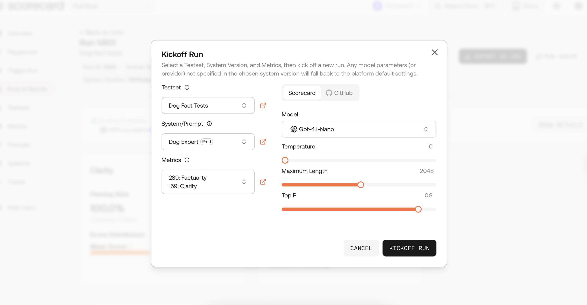
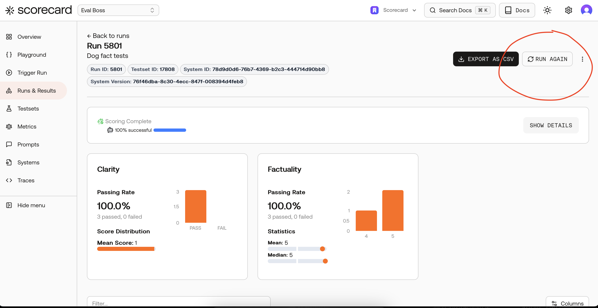
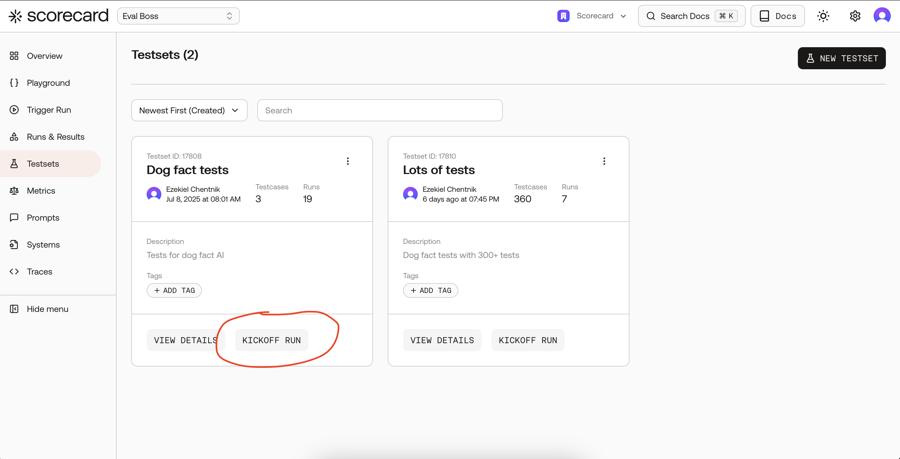
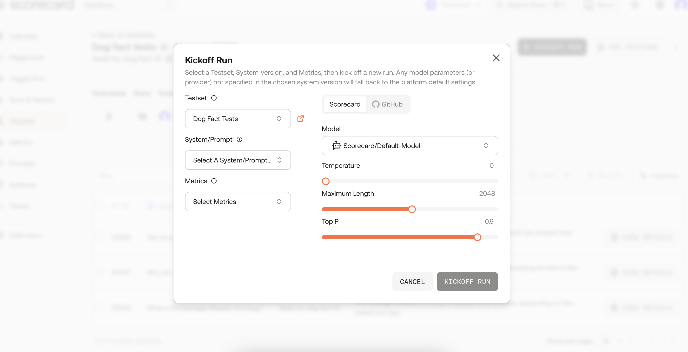
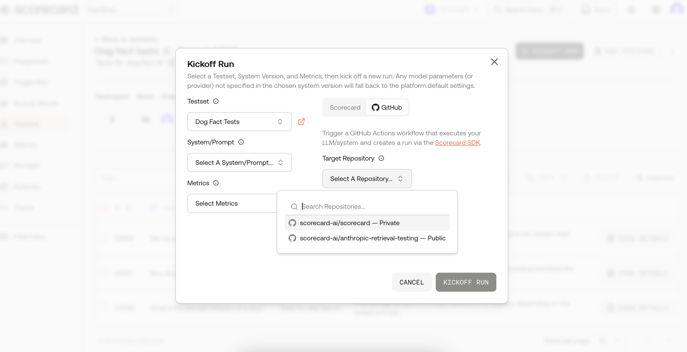

## What you can do

- Generate a new run against any Testset in your project
- Select a specific System Version (prompt \+ hyper-parameters) to test
- Evaluate with one or more built-in or custom metrics
- Optionally dispatch a GitHub Actions workflow to run your own code and report results back
- Tweak model parameters (temperature, max tokens, etc.) without touching code

## Prerequisites

1. A **Project** with at least one **Testset**
2. A **System Version** that defines a `promptTemplate` and (optionally) model parameters
3. One or more **Metrics** attached to the Project
4. (GitHub tab only) The **Scorecard GitHub App** installed on the repository you want to trigger

:::note
Need help creating these resources? See the quick-start guides for [Testsets](/features/testsets), [Systems](/features/systems) and [Metrics](/features/metrics).
:::

## Where to find the **Kickoff Run** button



You’ll encounter the same modal entry point across the app:

- **Projects dashboard** – every project card has a Kickoff Run action so you can start evaluating straight away.
- **Testsets list** – each testset card includes a Kickoff Run button, and the testset header actions add it too.
- **Testset detail page** – the action bar (next to “Add Testcase”) exposes Kickoff Run for quick iteration.
- **Runs detail (“Run Again”)** – open any run and click **Run Again** to re-run the identical testset/system combo, optionally tweak metrics or model parameters, and compare results side-by-side.
- **Playground** – after experimenting with prompts, hit **Kickoff Run** to transform ad-hoc tests into a fully tracked run.

Wherever you launch it, the modal auto-fills as much context as possible (selected testset, system version, metrics, etc.) to keep you in flow.

## Launching a run from the UI



:::steps

1. Navigate to **Projects → Testsets**.
2. Locate the Testset you want to evaluate and click **Kickoff Run**.
3. In the modal that appears, choose:
   - **Testset** (pre-selected if you started from a card)
   - **System Version**
   - **Metrics**
4. Pick a **tab**:
   - **Scorecard** – have Scorecard generate the outputs for you.
   - **GitHub** – hand off execution to your own workflow (great for custom runtimes or local models).
5. (Scorecard tab) Optionally adjust model parameters under **Model Settings**.
6. Click **Kickoff Run**. 🎉
   :::

### Scorecard tab

Scorecard calls the OpenAI or Anthropic APIs on your behalf.\
Inputs come from the Testset. Prompts and hyper-parameters come from the System Version (with platform defaults filling any gaps).



### GitHub tab

When you hit **Kickoff Run** Scorecard sends a [`repository_dispatch`](https://docs.github.com/en/actions/using-workflows/events-that-trigger-workflows#repository_dispatch) event to your repo.\
A minimal workflow is generated for you when you install the GitHub App, but you can customise it any way you like – just make sure it calls the Scorecard SDK to create records.



```yaml .github/workflows/scorecard.yml
on:
  repository_dispatch:
    types: [scorecard_run]

jobs:
  evaluate:
    runs-on: ubuntu-latest
    steps:
      - uses: actions/checkout@v4
      - run: pnpm install scorecard-ai
      - run: node scripts/scorecard-evaluate.js
        env:
          SCORECARD_API_KEY: ${{ secrets.SCORECARD_API_KEY }}
```

## Kicking off programmatically

### TypeScript

```ts
import Scorecard, { runAndEvaluate } from "scorecard-ai";

const client = new Scorecard(process.env.SCORECARD_API_KEY!, {
  // Optional: point at self-hosted instance
  baseURL: "https://app.scorecard.io/api",
});

type Inputs = { question: string };
type Outputs = { answer: string };

await runAndEvaluate<Inputs, Outputs>(client, {
  projectId: "proj_123",
  testsetId: "ts_456",
  metricIds: ["accuracy", "toxicity"],
  systemVersionId: "sysv_789", // optional
  async system({ question }) {
    // Call your model however you like
    const completion = await openai.chat.completions.create({
      model: "gpt-4o",
      messages: [{ role: "user", content: question }],
    });
    return { answer: completion.choices[0].message.content };
  },
});
```

### Python (beta)

```py
from scorecard import Scorecard, run_and_evaluate

client = Scorecard("<api_key>")

def system(inputs):
    # Call your model here
    return {"answer": llm(inputs["question"]) }

run_and_evaluate(
    client,
    project_id="proj_123",
    testset_id="ts_456",
    metric_ids=["accuracy", "toxicity"],
    system=system,
)
```

## Inputs & Outputs

| Field                        | Description                                        |
| ---------------------------- | -------------------------------------------------- |
| `projectId`                  | The project that owns the run                      |
| `testsetId` _or_ `testcases` | Source data to evaluate                            |
| `metricIds`                  | Metrics to compute on each record                  |
| `systemVersionId`            | Attach prompt & metadata (optional)                |
| `system`                     | Your function that turns inputs into outputs       |
| Returns                      | `{ id, url }` – link directly to the Run in the UI |

## Frequently Asked Questions

<Accordion>
  <AccordionItem title="Do I need a System Version?">
  While not strictly required, providing a System Version ensures your run is fully reproducible: prompts, model name and temperature are all stored automatically.
</AccordionItem>

  <AccordionItem title="Can I run on self-hosted models?">
  Absolutely. Use the GitHub tab or SDK route to call any model, then create records via the Scorecard API.
</AccordionItem>
</Accordion>

---

_Ready to measure what matters? Kick off your first run now\!_