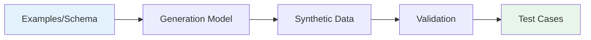

import { Tabs, Tab, CodeGroup, Note, Warning, Tip, Info } from "@mintlify/components";

## What is Synthetic Data Generation?

Synthetic Data Generation in Scorecard uses AI to automatically create diverse, realistic test cases for evaluating your AI applications. This powerful feature helps you:

- **Scale testing**: Generate hundreds of test cases in minutes
- **Increase coverage**: Create edge cases and scenarios you might not think of
- **Save time**: Reduce manual test case creation effort by 90%
- **Improve quality**: Ensure comprehensive testing across different scenarios

<Note>
  Synthetic data generation is particularly valuable for testing conversational AI, RAG systems, and complex prompts where manual test creation is time-consuming.
</Note>

## How It Works

Scorecard's generation uses advanced language models to create test data that matches your specific requirements:



### Generation Methods

<Tabs>
  <Tab title="Few-Shot Generation">
    Provide 3-5 examples, and Scorecard generates similar test cases:
    
    **Best for**: When you have existing test cases and want more variety
    
    ```python
    # Provide examples to guide generation
    examples = [
        {"input": "What's the weather?", "expected": "weather_intent"},
        {"input": "Will it rain today?", "expected": "weather_intent"},
        {"input": "Book a flight to NYC", "expected": "booking_intent"}
    ]
    ```
  </Tab>
  
  <Tab title="Schema-Based Generation">
    Define the structure and constraints for generated data:
    
    **Best for**: Structured data with specific requirements
    
    ```json
    {
      "input": "string: user question",
      "context": "string: relevant background",
      "expected_output": "string: correct answer",
      "difficulty": "enum: easy|medium|hard"
    }
    ```
  </Tab>
  
  <Tab title="Prompt-Guided Generation">
    Use natural language to describe what you need:
    
    **Best for**: Complex scenarios and creative test cases
    
    ```
    Generate customer support conversations where:
    - Customer is frustrated about a billing issue
    - Include both polite and demanding tones
    - Cover subscription, refund, and upgrade scenarios
    ```
  </Tab>
</Tabs>

## Generating Test Data

### Using the UI

Navigate to your testset and click **Generate Test Cases**:

<Steps>
  <Step title="Select Generation Method">
    Choose between few-shot, schema-based, or prompt-guided generation
  </Step>
  
  <Step title="Configure Parameters">
    Configure the number of test cases to generate (ranging from 5 to 500), select which AI model to use for generation, and adjust the temperature setting to control creativity (0.3 for consistent outputs, 0.8 for more diverse variations).
  </Step>
  
  <Step title="Provide Input">
    For few-shot generation, select 3-5 existing test cases as examples. Schema-based generation requires defining your data structure, while prompt-guided generation needs detailed written instructions.
  </Step>
  
  <Step title="Review & Import">
    Preview generated test cases and select which ones to add to your testset
  </Step>
</Steps>

### Using the API

<CodeGroup>
```python Python
import scorecard

client = scorecard.Client(api_key="YOUR_API_KEY")

# Few-shot generation with examples
generated = client.testsets.generate_testcases(
    testset_id="your-testset-id",
    method="few_shot",
    num_testcases=50,
    examples=[
        {
            "input": "How do I reset my password?",
            "expected_category": "account_management",
            "sentiment": "neutral"
        },
        {
            "input": "I can't log in! This is urgent!",
            "expected_category": "authentication",
            "sentiment": "frustrated"
        }
    ],
    model="gpt-4",
    temperature=0.7
)

# Add to testset
for testcase in generated:
    client.testcases.create(
        testset_id="your-testset-id",
        data=testcase
    )
```

```javascript JavaScript
import Scorecard from '@scorecard/client';

const client = new Scorecard({ apiKey: 'YOUR_API_KEY' });

// Prompt-guided generation
const generated = await client.testsets.generateTestcases({
  testsetId: 'your-testset-id',
  method: 'prompt',
  numTestcases: 30,
  prompt: `Generate diverse customer queries for an e-commerce chatbot:
    - Include questions about products, shipping, returns
    - Vary complexity from simple to complex
    - Include some queries with typos or informal language`,
  model: 'gpt-4',
  temperature: 0.8
});

// Add to testset
for (const testcase of generated) {
  await client.testcases.create({
    testsetId: 'your-testset-id',
    data: testcase
  });
}
```

```python Schema-Based
# Define schema for structured generation
schema = {
    "user_query": {
        "type": "string",
        "description": "Customer question or request"
    },
    "product_category": {
        "type": "enum",
        "values": ["electronics", "clothing", "home", "sports"],
        "description": "Relevant product category"
    },
    "intent": {
        "type": "enum",
        "values": ["purchase", "support", "return", "inquiry"],
        "description": "User's primary intent"
    },
    "urgency": {
        "type": "enum",
        "values": ["low", "medium", "high"],
        "description": "Query urgency level"
    }
}

generated = client.testsets.generate_testcases(
    testset_id="your-testset-id",
    method="schema",
    schema=schema,
    num_testcases=100,
    model="gpt-4",
    temperature=0.6
)
```
</CodeGroup>

## Advanced Generation Techniques

### Domain-Specific Generation

Generate test data for specific domains or industries:

<Tabs>
  <Tab title="Healthcare">
    ```python
    prompt = """
    Generate medical question-answer pairs for a healthcare AI assistant:
    - Include symptoms, treatments, and medication queries
    - Ensure medical accuracy and appropriate disclaimers
    - Cover both common and rare conditions
    - Vary patient demographics and medical history
    """
    ```
  </Tab>
  
  <Tab title="Finance">
    ```python
    prompt = """
    Generate banking customer service scenarios:
    - Cover accounts, loans, investments, and fraud
    - Include regulatory compliance questions
    - Vary customer sophistication levels
    - Include both personal and business banking
    """
    ```
  </Tab>
  
  <Tab title="E-commerce">
    ```python
    prompt = """
    Generate online shopping support conversations:
    - Product recommendations and comparisons
    - Order tracking and delivery issues
    - Returns, refunds, and exchanges
    - Payment and discount questions
    """
    ```
  </Tab>
</Tabs>

### Adversarial Test Generation

Create challenging test cases to find weaknesses:

```python
# Generate adversarial examples
adversarial = client.testsets.generate_testcases(
    testset_id="your-testset-id",
    method="adversarial",
    prompt="""
    Generate test cases that might cause issues:
    - Ambiguous or contradictory requests
    - Attempts to bypass safety guidelines
    - Edge cases with unusual formatting
    - Requests outside the system's scope
    """,
    num_testcases=25,
    model="gpt-4",
    temperature=0.9
)
```

### Multi-Turn Conversation Generation

Generate realistic conversation flows:

```python
conversations = client.testsets.generate_conversations(
    testset_id="conversation-testset",
    num_conversations=20,
    turns_per_conversation=5,
    scenario="""
    Customer service conversation for a SaaS platform:
    - Start with initial question or issue
    - Include follow-up questions
    - Add clarifications and context
    - Resolve or escalate appropriately
    """,
    personas=[
        "Tech-savvy developer",
        "Non-technical business user",
        "Frustrated enterprise customer"
    ]
)
```

## Quality Control

### Validation Rules

<Warning>
  Always validate generated data before using it in production evaluations.
</Warning>

Set up validation rules for generated test cases:

```python
validation_rules = {
    "input_length": {"min": 10, "max": 500},
    "required_fields": ["input", "expected_output"],
    "format_checks": {
        "email": r"^[a-zA-Z0-9._%+-]+@[a-zA-Z0-9.-]+\.[a-zA-Z]{2,}$",
        "phone": r"^\+?1?\d{9,15}$"
    },
    "content_filters": {
        "no_pii": True,
        "no_profanity": True,
        "no_bias": True
    }
}

# Generate with validation
generated = client.testsets.generate_testcases(
    testset_id="your-testset-id",
    validation_rules=validation_rules,
    # ... other parameters
)
```

### Diversity Metrics

Ensure generated data covers diverse scenarios:

```python
# Analyze diversity of generated testcases
diversity_report = client.testsets.analyze_diversity(
    testset_id="your-testset-id"
)

print(f"Unique patterns: {diversity_report.unique_patterns}")
print(f"Coverage score: {diversity_report.coverage_score}")
print(f"Complexity distribution: {diversity_report.complexity}")
```

### Manual Review Process

<Info>
  Implement a review workflow for generated test cases before adding them to your evaluation suite.
</Info>

```python
# Generate with review flag
generated = client.testsets.generate_testcases(
    testset_id="your-testset-id",
    status="pending_review",  # Mark for review
    # ... other parameters
)

# Review and approve
for testcase in generated:
    if meets_quality_standards(testcase):
        client.testcases.update(
            testcase_id=testcase.id,
            status="approved"
        )
```

## Best Practices

### Generation Strategy

<Tip>
  Start with a small batch (10-20 test cases) to validate quality before generating larger sets.
</Tip>

1. **Iterative Refinement**: Generate small batches and refine your prompts
2. **Combine Methods**: Use multiple generation techniques for comprehensive coverage
3. **Balance Diversity**: Mix common cases with edge cases
4. **Version Control**: Track generation parameters for reproducibility

### Cost Optimization

Manage generation costs effectively:

```python
# Use efficient models for large-scale generation
config = {
    "exploration": {
        "model": "gpt-4",  # High quality for initial exploration
        "num_testcases": 20,
        "temperature": 0.8
    },
    "bulk_generation": {
        "model": "gpt-3.5-turbo",  # Cost-effective for bulk
        "num_testcases": 500,
        "temperature": 0.6
    }
}
```

### Data Augmentation

Enhance existing test sets:

```python
# Augment existing testcases with variations
augmented = client.testsets.augment_testcases(
    testset_id="your-testset-id",
    augmentation_types=[
        "paraphrase",  # Rephrase inputs
        "typos",       # Add realistic typos
        "tone_shift",  # Change formality/tone
        "context_expansion"  # Add context
    ],
    num_variations_per_testcase=3
)
```

## Use Cases

### RAG System Testing

Generate question-context-answer triplets:

```python
rag_testcases = client.testsets.generate_testcases(
    testset_id="rag-testset",
    schema={
        "question": "User question about the topic",
        "context": "Relevant document excerpts",
        "expected_answer": "Correct answer based on context",
        "distractor_contexts": "Misleading but related contexts"
    },
    num_testcases=100
)
```

### Intent Classification

Generate diverse utterances for each intent:

```python
for intent in ["booking", "cancellation", "inquiry", "complaint"]:
    client.testsets.generate_testcases(
        testset_id="intent-testset",
        prompt=f"Generate 50 diverse user utterances for {intent} intent",
        constraints={
            "expected_intent": intent,
            "include_variations": ["formal", "informal", "misspelled"]
        }
    )
```

### Prompt Engineering

Test prompt robustness with variations:

```python
prompt_variations = client.testsets.generate_testcases(
    testset_id="prompt-testset",
    base_prompt="Summarize the following text:",
    variation_types=[
        "instruction_rephrasing",
        "constraint_addition",
        "example_inclusion",
        "format_specification"
    ],
    num_variations=20
)
```

## Troubleshooting

### Poor Quality Generation
- Provide more specific examples or constraints
- Adjust temperature (lower for consistency, higher for creativity)
- Use a more capable model
- Add validation rules

### Lack of Diversity
- Increase temperature parameter
- Provide diverse examples
- Use explicit diversity instructions in prompts
- Combine multiple generation methods

### High Costs
- Use smaller models for bulk generation
- Implement caching for similar requests
- Batch generation requests
- Set appropriate limits

## Related Resources

<Card title="Testsets" icon="vial" href="/features/testsets">
  Learn more about managing test data in Scorecard
</Card>

<Card title="Metrics" icon="chart-line" href="/features/best-in-class-metrics">
  Define metrics to evaluate generated test data quality
</Card>

<Card title="Testsets" icon="lightbulb" href="/features/testsets">
  Guidelines for creating effective test cases
</Card>

<Card title="API Reference" icon="code" href="/api-reference/overview">
  Complete API documentation for data generation
</Card>