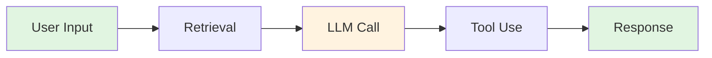

import { Tabs, Tab, CodeGroup, Note, Warning, Info, Tip } from "@mintlify/components";

## What are Traces?

Traces in Scorecard provide detailed visibility into your AI application's execution flow, capturing every step from user input to final output. This powerful observability feature enables you to pinpoint exactly where errors occur in complex AI pipelines, track latency at each step of your application, and understand token usage and API costs across different models. By identifying bottlenecks and optimization opportunities, traces become essential for improving your application's quality and performance.

<Note>
  Traces automatically capture errors, making it easy to track and resolve issues in production.
</Note>

## How Tracing Works

Scorecard's tracing follows the OpenTelemetry standard, capturing spans that represent individual operations in your application:



Each span contains comprehensive timing information including start time, duration, and latency measurements. The metadata captures the model used, parameters, and token counts, while any errors are recorded with full exception details and stack traces. Parent-child relationships between spans help you understand the complete execution flow.

## Setting Up Tracing

### Quick Start

<CodeGroup>
```python Python
import scorecard
from scorecard.tracing import trace

# Initialize the client with tracing enabled
client = scorecard.Client(
    api_key="YOUR_API_KEY",
    tracing_enabled=True
)

# Automatically trace function calls
@trace
def process_query(query: str):
    # Your AI pipeline logic
    context = retrieve_context(query)
    response = generate_response(context)
    return response

# Traces are automatically sent to Scorecard
result = process_query("What is error tracking?")
```

```javascript JavaScript
import Scorecard from '@scorecard/client';
import { trace } from '@scorecard/tracing';

// Initialize the client with tracing enabled
const client = new Scorecard({
  apiKey: 'YOUR_API_KEY',
  tracingEnabled: true
});

// Automatically trace function calls
const processQuery = trace(async (query) => {
  // Your AI pipeline logic
  const context = await retrieveContext(query);
  const response = await generateResponse(context);
  return response;
});

// Traces are automatically sent to Scorecard
const result = await processQuery("What is error tracking?");
```

```python OpenTelemetry
from opentelemetry import trace
from opentelemetry.exporter.otlp.proto.http.trace_exporter import OTLPSpanExporter
from opentelemetry.sdk.trace import TracerProvider
from opentelemetry.sdk.trace.export import BatchSpanProcessor

# Configure OpenTelemetry to send to Scorecard
exporter = OTLPSpanExporter(
    endpoint="https://api.scorecard.com/v1/traces",
    headers={"Authorization": "Bearer YOUR_API_KEY"}
)

provider = TracerProvider()
processor = BatchSpanProcessor(exporter)
provider.add_span_processor(processor)
trace.set_tracer_provider(provider)

# Use standard OpenTelemetry APIs
tracer = trace.get_tracer(__name__)
```
</CodeGroup>

### Framework Integration

<Tabs>
  <Tab title="LangChain">
    ```python
    from langchain.callbacks import ScorecardCallbackHandler
    
    # Add Scorecard callback to your chain
    handler = ScorecardCallbackHandler(
        api_key="YOUR_API_KEY",
        project_id="your-project-id"
    )
    
    chain = LLMChain(
        llm=llm,
        prompt=prompt,
        callbacks=[handler]
    )
    ```
  </Tab>
  
  <Tab title="LlamaIndex">
    ```python
    from llama_index.callbacks import ScorecardCallbackHandler
    
    # Configure LlamaIndex with Scorecard
    callback_handler = ScorecardCallbackHandler(
        api_key="YOUR_API_KEY",
        project_id="your-project-id"
    )
    
    Settings.callback_manager = CallbackManager([callback_handler])
    ```
  </Tab>
  
  <Tab title="OpenAI">
    ```python
    from openai import OpenAI
    from scorecard.integrations import openai_wrapper
    
    # Wrap OpenAI client for automatic tracing
    client = openai_wrapper(
        OpenAI(api_key="OPENAI_KEY"),
        scorecard_api_key="SCORECARD_KEY"
    )
    
    # All calls are automatically traced
    response = client.chat.completions.create(
        model="gpt-4",
        messages=[{"role": "user", "content": "Hello"}]
    )
    ```
  </Tab>
</Tabs>

## Viewing Traces

Navigate to the **Traces** section in your project to explore captured traces.

### Trace Explorer

The trace explorer provides powerful filtering and search capabilities:

- **Time range**: Filter by last hour, day, week, or custom range
- **Search**: Find traces by content, error messages, or metadata
- **Status**: Filter by success, error, or warning states
- **Service**: Group by different components of your application

### Trace Details

Click on any trace to view detailed information:

<Tabs>
  <Tab title="Timeline View">
    Visual representation of span execution:
    - Hierarchical span relationships
    - Duration visualization
    - Critical path highlighting
  </Tab>
  
  <Tab title="Span Details">
    Detailed information for each span:
    - Input/output data
    - Model parameters
    - Token usage
    - Error details and stack traces
  </Tab>
  
  <Tab title="Metrics">
    Aggregated metrics across the trace:
    - Total duration
    - Token counts
    - Cost breakdown
    - Error rate
  </Tab>
</Tabs>

## Error Tracking

Scorecard provides comprehensive error tracking that goes beyond simple technical failures to detect AI-specific issues and behavioral problems in your applications.

### AI-Specific Error Detection

<Info>
  Scorecard acts as an always-on watchdog, monitoring every AI interaction to catch both technical errors and subtle behavioral issues.
</Info>

**Behavioral Errors (Silent Failures)** represent the most dangerous category of AI errors. These include off-topic responses where the AI ventures outside its intended scope, workflow interruptions that break conversation flows or task sequences, and safety violations where responses breach established guidelines or policies. The system also detects hallucinations when factually incorrect information is presented confidently, and context loss when the AI loses track of conversation history or user intent.

**Technical Errors** encompass traditional system failures including model errors such as rate limits, timeouts, invalid requests, and API failures. Application errors cover exceptions, crashes, and logic errors in your code, while validation errors catch schema mismatches, type errors, and format issues. Integration errors arise from downstream API failures or network connectivity issues, and configuration errors result from invalid parameters, missing credentials, or model misconfigurations.

### Silent Failure Detection

The most dangerous errors in AI systems are "silent failures" - when your AI responds but incorrectly. Scorecard automatically detects these through:

```python
# Scorecard automatically analyzes responses for:
# - Semantic drift from expected behavior
# - Safety policy violations  
# - Factual accuracy issues
# - Task completion failures

# Example: Detecting off-topic responses
from scorecard import Client

client = Client(api_key="your-key")

# Custom error detection metric
safety_metric = client.metrics.create(
    name="Off-Topic Detection",
    description="Detect when AI goes off-topic",
    config={
        "type": "ai_binary",
        "prompt": """
        Does the assistant's response stay on-topic and address the user's question?
        
        User Question: {{input}}
        Assistant Response: {{output}}
        
        Answer YES if response is on-topic, NO if off-topic.
        """,
        "scoring": {"pass_threshold": 0.8}
    }
)
```

### Error Analytics Dashboard

The error analytics dashboard provides **real-time monitoring** with live error rate tracking across all AI interactions, immediate alerts for error spikes or new failure patterns, and error distribution analysis by type, severity, and affected users. **Failure pattern detection** helps identify recurring behavioral issues across conversations, detect systematic problems with specific prompts or model configurations, and track error trends over time and deployments. **Root cause analysis** capabilities include full reasoning chain replay for any failed interaction, contextual error explanations with user intent analysis, and impact assessments showing affected users and conversations.

### Error Details

Each error capture includes:

```json
{
  "error_type": "RateLimitError",
  "message": "Rate limit exceeded for model gpt-4",
  "stack_trace": "...",
  "span_id": "abc123",
  "timestamp": "2024-01-15T10:30:00Z",
  "context": {
    "model": "gpt-4",
    "retry_after": 60,
    "request_id": "req_123"
  }
}
```

### Error Analytics

Monitor error trends and patterns:

- **Error rate**: Percentage of failed traces over time
- **Error distribution**: Breakdown by error type
- **Impact analysis**: Which errors affect the most users
- **Recovery time**: How quickly errors are resolved

## Custom Instrumentation

Add custom spans to capture application-specific operations:

<CodeGroup>
```python Python
from scorecard.tracing import tracer

def process_document(doc_id: str):
    with tracer.start_span("document_processing") as span:
        # Add custom attributes
        span.set_attribute("document_id", doc_id)
        span.set_attribute("processing_type", "extraction")
        
        try:
            # Your processing logic
            content = extract_content(doc_id)
            entities = extract_entities(content)
            
            span.set_attribute("entity_count", len(entities))
            return entities
            
        except Exception as e:
            # Errors are automatically captured
            span.record_exception(e)
            span.set_status(Status.ERROR, str(e))
            raise
```

```javascript JavaScript
import { tracer } from '@scorecard/tracing';

async function processDocument(docId) {
  const span = tracer.startSpan('document_processing');
  
  try {
    // Add custom attributes
    span.setAttributes({
      document_id: docId,
      processing_type: 'extraction'
    });
    
    // Your processing logic
    const content = await extractContent(docId);
    const entities = await extractEntities(content);
    
    span.setAttribute('entity_count', entities.length);
    return entities;
    
  } catch (error) {
    // Errors are automatically captured
    span.recordException(error);
    span.setStatus({ code: SpanStatusCode.ERROR });
    throw error;
  } finally {
    span.end();
  }
}
```
</CodeGroup>

## Performance Monitoring

### Latency Analysis

Identify performance bottlenecks:

```python
# Get trace performance metrics
metrics = client.traces.get_metrics(
    project_id="your-project-id",
    time_range="24h"
)

print(f"P50 latency: {metrics.p50_latency}ms")
print(f"P95 latency: {metrics.p95_latency}ms")
print(f"P99 latency: {metrics.p99_latency}ms")

# Find slowest operations
slow_spans = client.traces.get_slow_spans(
    project_id="your-project-id",
    threshold_ms=1000
)
```

### Cost Tracking

Monitor API and token costs:

```python
# Get cost breakdown by model
costs = client.traces.get_costs(
    project_id="your-project-id",
    group_by="model",
    time_range="7d"
)

for model, cost in costs.items():
    print(f"{model}: ${cost:.2f}")
```

## Alerting & Monitoring

Set up alerts for trace anomalies:

<Tabs>
  <Tab title="Error Rate Alerts">
    ```python
    alert = client.alerts.create(
        name="High Error Rate",
        metric="error_rate",
        threshold=0.05,  # 5% error rate
        window="5m",
        notification_channel="email"
    )
    ```
  </Tab>
  
  <Tab title="Latency Alerts">
    ```python
    alert = client.alerts.create(
        name="High Latency",
        metric="p95_latency",
        threshold=5000,  # 5 seconds
        window="10m",
        notification_channel="slack"
    )
    ```
  </Tab>
  
  <Tab title="Cost Alerts">
    ```python
    alert = client.alerts.create(
        name="High API Costs",
        metric="daily_cost",
        threshold=100,  # $100/day
        window="24h",
        notification_channel="pagerduty"
    )
    ```
  </Tab>
</Tabs>

## Best Practices

### Sampling Strategies

<Warning>
  High-volume applications should implement sampling to control costs and data volume.
</Warning>

```python
# Configure sampling rate
client = scorecard.Client(
    api_key="YOUR_API_KEY",
    tracing_sample_rate=0.1  # Sample 10% of traces
)

# Or use adaptive sampling
client.configure_adaptive_sampling(
    error_sample_rate=1.0,  # Always sample errors
    success_sample_rate=0.01,  # Sample 1% of successful traces
    slow_sample_rate=0.5  # Sample 50% of slow traces
)
```

### Privacy & Security

Protect sensitive data in traces:

```python
# Configure data redaction
client.configure_redaction(
    redact_patterns=[
        r"\b\d{3}-\d{2}-\d{4}\b",  # SSN
        r"\b[A-Za-z0-9._%+-]+@[A-Za-z0-9.-]+\.[A-Z|a-z]{2,}\b",  # Email
    ],
    redact_fields=["password", "api_key", "token"]
)
```

### Trace Context Propagation

Ensure traces span across services:

```python
# Extract trace context for downstream services
context = tracer.get_current_context()
headers = {
    "traceparent": context.traceparent,
    "tracestate": context.tracestate
}

# Make request with trace context
response = requests.post(
    "https://downstream-service.com/api",
    headers=headers,
    json=data
)
```

## Troubleshooting

### Missing Traces
- Verify tracing is enabled in your client configuration
- Check your sampling rate settings
- Ensure your API key has tracing permissions

### Incomplete Spans
- Verify all spans are properly closed
- Check for unhandled exceptions
- Ensure trace context is propagated correctly

### High Latency
- Review sampling rates
- Batch trace exports
- Use async trace submission

## Related Resources

<Card title="Monitoring" icon="bell" href="/features/monitoring">
  Set up continuous monitoring for your traces
</Card>

<Card title="Metrics" icon="chart-line" href="/features/best-in-class-metrics">
  Define custom metrics based on trace data
</Card>

<Card title="API Reference" icon="code" href="/api-reference/overview">
  Complete API documentation for traces
</Card>

<Card title="OpenTelemetry" icon="telescope" href="https://opentelemetry.io">
  Learn more about the OpenTelemetry standard
</Card>