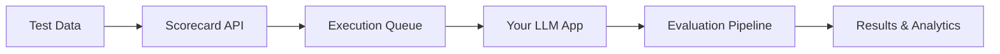

<!-- Fresh file created to fix navigation issues -->

## Architecture Overview

Scorecard is built on four core primitives that power all LLM testing workflows:

<Frame caption="Scorecard Core Architecture">

</Frame>

<Info>
**For engineers:** This guide covers Scorecard's technical implementation. For a product overview, see [What is Scorecard?](/intro/what-is-scorecard)
</Info>

## Core Primitives

<Tabs>
  <Tab title="Testsets">
    ### Testsets
    Collections of test cases representing real-world scenarios.
    
    ```typescript
    interface Testset {
      id: string
      name: string
      cases: TestCase[]
      metadata: {
        version: string
        created_at: timestamp
        tags: string[]
      }
    }
    
    interface TestCase {
      id: string
      input: {
        prompt: string
        context?: string
        parameters?: Record<string, any>
      }
      expected?: {
        output?: string
        criteria?: EvaluationCriteria[]
      }
    }
    ```
    
    **Storage:** PostgreSQL with version control
    **Access:** REST API, SDK, UI
  </Tab>
  <Tab title="Runs">
    ### Runs
    Executions of testsets against your LLM application.
    
    ```typescript
    interface Run {
      id: string
      testset_id: string
      status: 'pending' | 'running' | 'completed' | 'failed'
      config: {
        model: string
        temperature: number
        max_tokens: number
        system_prompt?: string
        // ... other model params
      }
      results: RunResult[]
      metadata: {
        triggered_by: 'api' | 'ui' | 'ci'
        environment: string
        commit_sha?: string
      }
    }
    ```
    
    **Execution:** Async job queue (Redis + workers)
    **Storage:** S3 for outputs, PostgreSQL for metadata
  </Tab>
  <Tab title="Metrics">
    ### Metrics
    Evaluation functions that score LLM outputs.
    
    ```python
    class Metric:
        def evaluate(self, 
                    input: str,  # User input/prompt
                    output: str,  # LLM generated response
                    expected: Optional[str] = None) -> Score:  # Expected output (optional)
            # Implementation of metric evaluation logic
            pass
    
    # Pre-built metrics
    metrics = [
        "relevance",      # Output addresses the input
        "coherence",      # Logical flow and clarity
        "factuality",     # Accuracy of claims
        "safety",         # No harmful content
        "helpfulness",    # Useful for the user
    ]
    
    # Custom metric example
    class ToneMetric(Metric):
        def evaluate(self, input, output, expected=None):
            # Check if output matches desired tone
            return Score(value=0.95, reasoning="Professional tone")
    ```
    
    **Evaluation:** Python workers with GPU support
    **Caching:** Redis for repeated evaluations
  </Tab>
  <Tab title="Systems">
    ### Systems
    Your LLM application endpoints and configurations.
    
    ```typescript
    interface System {
      id: string
      name: string
      type: 'api' | 'sdk' | 'playground'
      endpoint?: string
      auth?: {
        type: 'bearer' | 'api_key' | 'oauth'
        credentials: encrypted  // AES-256 encrypted
      }
      default_config: ModelConfig
      rate_limits: {
        requests_per_minute: number
        tokens_per_minute: number
      }
    }
    ```
    
    **Integration:** REST API, gRPC, WebSockets
    **Security:** End-to-end encryption, key rotation
  </Tab>
</Tabs>

## System Architecture

### High-Level Data Flow



### Detailed Architecture

<Tabs>
  <Tab title="API Layer">
    **Tech Stack:**
    - FastAPI (Python) for REST endpoints
    - GraphQL for complex queries
    - WebSocket for real-time updates
    
    **Key Endpoints:**
    ```bash
    POST   /v2/testsets          # Create testset
    GET    /v2/testsets/{id}     # Get testset
    POST   /v2/runs              # Start run
    GET    /v2/runs/{id}/stream  # Stream results
    POST   /v2/metrics           # Create custom metric
    ```
    
    **Rate Limiting:** Token bucket algorithm (sliding window)
    **Auth:** JWT with refresh tokens (RS256 signature)
  </Tab>
  <Tab title="Execution Engine">
    **Components:**
    - Redis queue for job distribution
    - Python workers with Celery
    - Kubernetes for auto-scaling
    
    **Flow:**
    1. API receives run request
    2. Job queued in Redis
    3. Worker picks up job
    4. Executes against LLM endpoint
    5. Streams results back
    
    **Optimizations:**
    - Batching for efficiency
    - Retry logic with exponential backoff
    - Circuit breaker for failing endpoints
  </Tab>
  <Tab title="Evaluation Pipeline">
    **Architecture:**
    ```python
    # Evaluation pipeline
    async def evaluate_run(run_id: str):
        run = await fetch_run(run_id)
        
        # Parallel metric evaluation
        tasks = [
            evaluate_metric(output, metric)
            for output in run.outputs
            for metric in run.metrics
        ]
        
        results = await asyncio.gather(*tasks)
        await store_results(run_id, results)
    ```
    
    **LLM-as-Judge:**
    - Uses GPT-4 for evaluation
    - Caches similar evaluations
    - Falls back to rules if LLM fails
  </Tab>
  <Tab title="Storage Layer">
    **Databases:**
    - PostgreSQL: Metadata, configurations
    - S3: Large outputs, logs
    - Redis: Cache, queues
    - ClickHouse: Analytics, time-series
    
    **Data Model:**
    ```sql
    -- Core tables
    testsets
    ├── testcases
    ├── versions
    └── permissions
    
    runs
    ├── run_configs
    ├── run_outputs
    └── run_scores
    
    metrics
    ├── metric_definitions
    └── metric_evaluations
    ```
  </Tab>
</Tabs>

## Integration Patterns

### SDK Integration

<CodeGroup>
```python Python
from scorecard import Scorecard

# Initialize client
sc = Scorecard(api_key="sc_key_...")

# Async execution pattern
async def test_my_llm():
    # Create run
    run = await sc.create_run(
        testset_id="customer-support",
        config={"model": "gpt-4", "temperature": 0.7}
    )
    
    # Execute with your app
    async for testcase in run.testcases:
        response = await my_llm_app(
            prompt=testcase.input.prompt,
            context=testcase.input.context
        )
        await run.log_output(testcase.id, response)
    
    # Evaluate
    results = await run.evaluate(
        metrics=["helpfulness", "accuracy"]
    )
    
    return results
```

```typescript TypeScript
import { Scorecard } from '@scorecard/sdk';

const sc = new Scorecard({ apiKey: 'sc_key_...' });

// Streaming pattern
const run = await sc.createRun({
  testsetId: 'customer-support',
  config: { model: 'gpt-4', temperature: 0.7 }
});

// Stream results as they complete
for await (const result of run.stream()) {
  console.log(`Test ${result.testcaseId}: ${result.score}`);
}
```
</CodeGroup>

### CI/CD Integration

<CodeGroup>
```yaml GitHub Actions
name: LLM Tests
on: [push, pull_request]

jobs:
  test:
    runs-on: ubuntu-latest
    steps:
      - uses: actions/checkout@v3
      
      - name: Run Scorecard Tests
        uses: scorecard-ai/action@v1
        with:
          api-key: ${{ secrets.SCORECARD_API_KEY }}
          testset-id: 'regression-suite'
          fail-on-regression: true
          
      - name: Comment Results
        uses: scorecard-ai/comment-action@v1
        if: github.event_name == 'pull_request'
```

```groovy Jenkins
pipeline {
    agent any
    
    stages {
        stage('LLM Tests') {
            steps {
                script {
                    def scorecard = new ScorecardClient(
                        apiKey: env.SCORECARD_API_KEY
                    )
                    
                    def results = scorecard.runTests(
                        testsetId: 'regression-suite',
                        config: [model: 'gpt-4']
                    )
                    
                    if (results.hasRegressions()) {
                        error "LLM quality regression detected"
                    }
                }
            }
        }
    }
}
```
</CodeGroup>

### Direct API Usage

```bash
# Create a run
curl -X POST https://api.scorecard.ai/v2/runs \
  -H "Authorization: Bearer $SCORECARD_API_KEY" \
  -d '{
    "testset_id": "customer-support",
    "config": {"model": "gpt-4"}
  }'

# Stream results via SSE
curl -N https://api.scorecard.ai/v2/runs/{run_id}/stream \
  -H "Authorization: Bearer $SCORECARD_API_KEY"
```

## Implementation Workflow

<Steps>
  <Step title="Data Preparation" icon="database">
    <Frame caption="Ingesting Testcases into Scorecard">
    
    </Frame>
    
    **Best practices:**
    - Start with production logs
    - Include edge cases
    - Version control testsets
    - Tag by feature/risk level
  </Step>
  
  <Step title="Execution" icon="play">
    <Frame caption="Executing Your LLM App With Scorecard">
    
    </Frame>
    
    **Execution modes:**
    - **Playground**: Manual testing
    - **SDK**: Development workflow
    - **CI/CD**: Automated checks
    - **Monitoring**: Production traffic
  </Step>
  
  <Step title="Evaluation" icon="chart-line">
    <Frame caption="Scoring Your LLM App With Scorecard">
    
    </Frame>
    
    **Evaluation stack:**
    1. Rule-based checks (fast)
    2. LLM-as-judge (accurate)
    3. Human review (ground truth)
    4. Meta-evaluation (validation)
  </Step>
</Steps>

## Performance & Scale

### Benchmarks

<Tabs>
  <Tab title="Throughput">
    | Testset Size | Execution Time | Tokens/sec |
    |--------------|----------------|------------|
    | 10 tests     | <1 second      | 50K        |
    | 100 tests    | 5 seconds      | 45K        |
    | 1000 tests   | 45 seconds     | 40K        |
    | 10K tests    | 7 minutes      | 35K        |
    
    *Benchmarked on standard infrastructure with GPT-4*
  </Tab>
  <Tab title="Scaling">
    **Horizontal scaling:**
    - Workers auto-scale based on queue depth
    - Kubernetes HPA for API pods
    - Read replicas for database
    
    **Optimizations:**
    - Request batching (up to 100x)
    - Smart caching (90% hit rate)
    - Connection pooling
    - GPU inference for metrics
  </Tab>
  <Tab title="Limits">
    | Resource | Limit | Notes |
    |----------|-------|-------|
    | Testset size | 100K tests | Contact for larger |
    | Output size | 100KB/test | Compressed |
    | Concurrent runs | 1000 | Per organization |
    | API rate | 1000 req/min | Burstable |
  </Tab>
</Tabs>

### Security Architecture

<AccordionGroup>
  <Accordion title="Authentication & Authorization" icon="lock">
    - **API Keys**: Scoped permissions, rotation support
    - **SSO**: SAML 2.0, OAuth 2.0, OpenID Connect
    - **RBAC**: Fine-grained permissions by resource
    - **MFA**: Required for admin actions
  </Accordion>
  <Accordion title="Data Security" icon="shield">
    - **Encryption**: AES-256-GCM at rest, TLS 1.3 in transit
    - **Key Management**: AWS KMS with automatic rotation (AES-256 keys)
    - **Data Isolation**: Logical separation by org
    - **PII Handling**: Automatic detection and masking
  </Accordion>
  <Accordion title="Compliance" icon="certificate">
    - **SOC 2 Type II**: Annual audit
    - **GDPR**: Full compliance, data residency options
    - **HIPAA**: BAA available for healthcare
    - **ISO 27001**: In progress
  </Accordion>
</AccordionGroup>

## Developer Resources

<CardGroup cols={2}>
  <Card title="API Reference" icon="code" href="/api-reference">
    Complete API documentation with examples
  </Card>
  <Card title="SDK Docs" icon="book" href="/how-to-use-scorecard/using-the-sdk">
    Python, TypeScript, and more
  </Card>
  <Card title="Example Apps" icon="github" href="https://github.com/scorecard-ai/examples">
    Reference implementations
  </Card>
  <Card title="Status Page" icon="signal" href="https://status.scorecard.ai">
    Real-time system status
  </Card>
</CardGroup>

<Note>
**Questions?** Engineering support available at engineering@scorecard.ai or in #engineering on [Slack](https://scorecard.io/slack).
</Note>